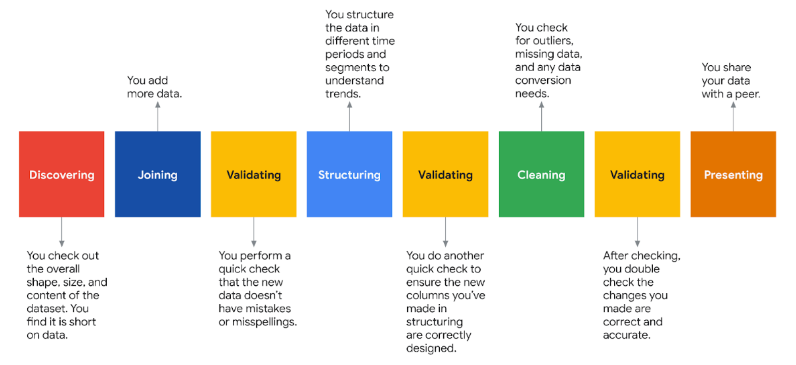

# Performing-Exploratory-Data-Analysis
Exploratory Data Analysis (EDA) is a crucial initial step in the data analysis process, used to examine and understand the characteristics of a dataset.

    

## Overview 

Exploratory Data Analysis (EDA) is an essential phase in data analysis, comprising several key steps. First, data is collected and cleaned to address missing values or inconsistencies. Next, data is visually explored using various plots and charts to understand its distribution and relationships. Descriptive statistics, such as mean and standard deviation, help summarize data characteristics. Identification of outliers, anomalies, and patterns is crucial. Finally, EDA often involves generating hypotheses and conducting deeper investigations into the data. In essence, EDA offers a comprehensive view of the dataset, enabling data scientists and analysts to uncover insights, prepare data for modeling, and make informed decisions.

## Business Understanding 

In the context of business understanding, Exploratory Data Analysis (EDA) serves as a vital bridge between raw data and actionable insights. For data analysts, EDA is the key to unlocking the potential of data, making it more interpretable and ready for modeling. It helps to uncover hidden patterns, anomalies, and relationships in the data, which are critical for making informed business decisions. EDA not only prepares the data but also equips analysts with the knowledge and understanding needed to refine their hypotheses and develop effective modeling strategies.

## Data Understanding

This project used a dataset called "2017_Yellow_Taxi_Trip_Data.csv." merged with "nyc_preds_means.csv" The data in "2017_Yellow_Taxi_Trip_Data.csv" was gathered by the New York City Taxi & Limousine Commission and published by the city of New York as part of their NYC Open Data program. Refer to [NYC taxi dataset](https://data.cityofnewyork.us/Transportation/2017-Yellow-Taxi-Trip-Data/biws-g3hs) for more informations.

## Conclusion

Following Exploratory Data Analysis (EDA), the dataset is primed and ready for model fitting. EDA equips us with the necessary understanding of the data's characteristics and nuances, making it possible to construct models that will yield valuable insights to address the problem at hand.
